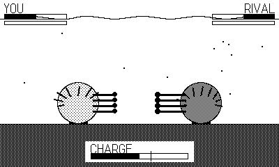

# AnEnemy

> Part of **[plAIdate](https://plaidate.github.io)** — AI-built 1-bit games, ports, and engines for the Playdate.

Sea-anemone territorial warfare, for Playdate.

You command the front-line warrior polyps of a clone colony. Where your clone
meets a genetically distinct rival, a no-man's-land forms and the two sting each
other with **acrorhagi** — venom-packed fighting tentacles — until one deflates,
withdraws, and cedes the rock. Full design in [DESIGN.md](DESIGN.md); the
player's manual — controls, tide, predators, strains and tips — is
[MANUAL.md](MANUAL.md).

## Play it

Grab the prebuilt `AnEnemy.pdx.zip` from the GitHub Releases page (or `dist/`
in a release checkout), then sideload it at
<https://play.date/account/sideload/> — or unzip it and open the .pdx in the
Playdate Simulator. To build from source instead, see [Development](#development).

**Status: v1.0 — complete.** All five phases shipped: the crank-engorged core
duel, the full tide cycle (contract, heal and desiccate on the bared rock under
a diving gull and a grazing *Aeolidia* nudibranch), the territory war across a
rock of cells where held ground reinforces your next skirmish, a four-strain
campaign ladder (glass-cannon Actinia, tank Metridium, attrition Urticina and a
nudibranch boss) with tide-phase step-sequencer music, and the polish pass —
breathing procedural anemones, an animated title, and records that persist
between sessions. 1-bit, procedural, all-synth audio, no asset files.

## Controls

- **Crank forward** — engorge your acrorhagi (raise charge and reach).
- **Crank back** — deflate the charge (conserve energy, bail out of a wind-up).
- **Ⓐ** — lash across the gap with your current charge; confirm on menus.

A lash only connects if its reach spans the gap — the **connect** tick on the
charge meter marks the minimum. Charge past it to sting harder, but engorging
stops your feeding and burns energy, and being stung mid-charge drops your
charge. Feed on the drifting plankton to refuel.

## Development

    make            # release  -> out/AnEnemy.pdx
    make smoke      # headless  -> out/AnEnemySmoke.pdx
    tools/smoke.sh 120 '"state":"done"'   # headless smoke run + report

The full build plan and biology→mechanic mapping is in [DESIGN.md](DESIGN.md).

